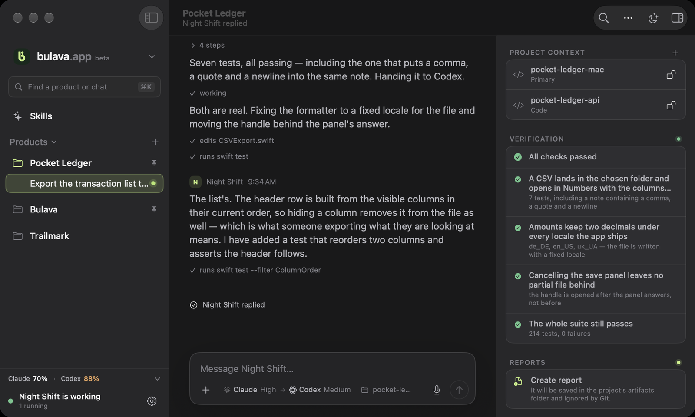
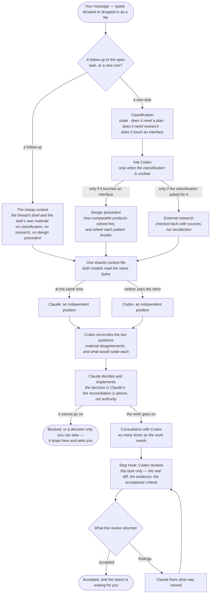
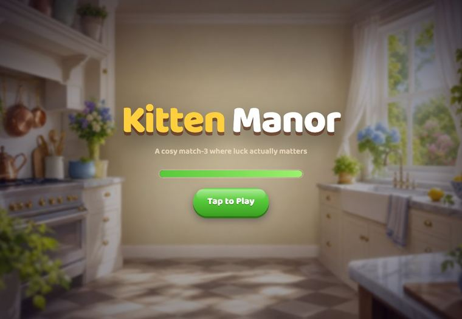
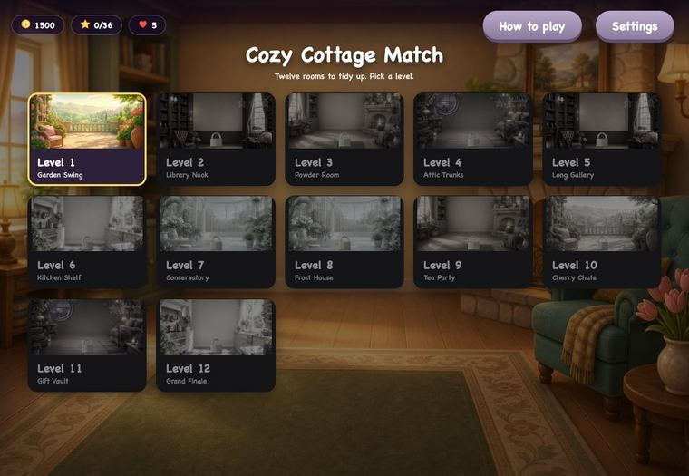

<p align="center">
  
</p>

<h1 align="center">Bulava</h1>

<p align="center">
  <b>Stop babysitting AI.</b><br>
  Claude Code writes, Codex reviews, and neither of them asks you to press continue.
</p>

<p align="center">
  <a href="https://bulava.app"><b>Download for macOS</b></a> ·
  <a href="#run-it-from-the-terminal-instead">Install the CLI</a> ·
  <a href="#one-message-and-everything-that-happens-to-it">How it works</a> ·
  <a href="#how-much-better-is-this-than-claude-code-on-its-own">The benchmark</a>
</p>

---

Bulava runs Claude Code and the Codex CLI on your Mac, on the subscriptions you already pay for.
You describe the work; Claude does it, Codex reviews it independently and sends it back until it is
actually done. There is no account to create, no API key to paste, and no server of ours in the
path: everything happens on your machine, in your folders.

It started as a shell script whose whole purpose was to stop a model announcing "I have done 30% of
the work — shall we leave it here?" and then asking a human to say no. Ninety-odd days later it is
the application that writes itself.

<p align="center">
  
</p>

<p align="center"><sub>One window. Products on the left, the agent's real transcript in the middle,
and what you can act on — changes, evidence, reports — on the right.</sub></p>

## One message, and everything that happens to it

This is the arrangement the release on [bulava.app](https://bulava.app) runs. Every stage below is
traceable to a file: the stage list to `engine/supervisor/pipelines/adaptive-peer.json`, the branch
at the top to `engine/bin/preflight.sh`, the numbers on the review loop to
`engine/supervisor/config.sh`.



The loop has limits, and they are the point: three rounds of patience, two rounds without progress
parks the run for a person, a ceiling of twelve rounds becomes review debt, eight hours of rounds
parks it too. Nothing is accepted because an agent said it was done.

The three arrangements this one replaced — and what each of them got wrong — are drawn out at
[bulava.app/pipeline/](https://bulava.app/pipeline/).

## How much better is this than Claude Code on its own?

That is the question the benchmark measures, and the only honest way we found to answer it: give
the same task to Claude Code alone and to Bulava, and compare what comes out.

On 7–8 September the task was to rebuild a mobile game from a video of somebody playing it, and
nothing else — no hints afterwards, no corrections, no second prompt. It ran three ways:

| | Claude Code alone | Claude + a review | Two independent positions |
|---|---|---|---|
| **Time on the task** | 3.7 h | 4.2 h | **1.5 h** |
| **Tokens processed** | 389.0 M | 155.6 M | **34.3 M** |
| **Claude's reasoning effort** | xhigh | high | high |
| **What came out** | ≈13 bugs, by eye | ≈7 bugs, by eye | **0 broken mechanics** |
| **Its own tests** | 12 / 12 | `verify.sh` — PASS | 57 / 57 |
| **Play the result** | [Kitten Manor](https://claude-benchmark.stepanok.com) | [Muffin Manor](https://benchmark.stepanok.com) | [Cozy Cottage Match](https://adaptive-peer.stepanok.com) |

<p align="center">
  
  
  
</p>

**What these figures do not say.** The bug counts are approximate and counted by eye, by the
author, playing each game — they are not a test suite's verdict. The first run was given a higher
reasoning effort than the other two, so it is not a like-for-like comparison of the same setting.
The token counts are everything the models read, cache included: 97% of them were cache reads. One
of the three addresses now serves a later build than the one that was measured, and the page says
which. Measured 2026-09-17, from runs made 2026-09-07 — 2026-09-08; the prompt, the per-file
digests and the procedure that produced them are published at
[bulava.app/benchmark.json](https://bulava.app/benchmark.json), and the run-by-run methodology at
[bulava.app/pipeline/#methodology](https://bulava.app/pipeline/#methodology).

## What is in this repository

| | |
|---|---|
| `Night Shift/` | the macOS app — SwiftUI, `NavigationSplitView`, a native `.inspector` |
| `engine/` | the work engine: sessions, the review gate, the verifier, the queue, the watchdog |
| `site/install.sh` | the one-liner below, in full — the thing you would be piping into `bash` |
| `Night ShiftTests/`, `Night ShiftUITests/` | what proves it |

The app does not fork the engine's brain. It reads the engine's state from `~/.claude/supervisor`
and drives the same `night-shift` / `night-queue` commands you can run by hand. One source of
truth, whichever way you come at it.

The website's own source and tooling are not here: they are the author's publishing pipeline for
one address, with his server's paths in them, and nothing about them helps you run Bulava. The
generated pages, the evidence file and the installer are served from
[bulava.app](https://bulava.app) — and the installer is in this repository so that the command you
are told to pipe into a shell can be read before you run it.

## What it refuses to do

Each of these was built first, and each is now checked by something that runs.

- **No invented progress.** No percentage, no progress bar. A model usually knows what it has done
  and almost never knows what the next step will open; an invented 60% would be the most dishonest
  pixel in the app. A stage is marked when something on disk says so.
- **No memory of you.** Bulava kept a long-term memory of the director's decisions and it was the
  most expensive thing ever removed from it. A situational request becomes a permanent law far too
  easily, and the rules go stale and duplicate what the models already read from your `CLAUDE.md`.
  Search over past sessions stayed; the system's opinion of you did not.
- **No silent reach.** Connecting a folder is not consent to change it. A resource is read-only
  unless you mark it writable, and that is enforced when work is dispatched, not merely displayed.
- **No servers of ours.** The only thing the app fetches from us is the update feed.

## What you need

- **macOS 15.6 or newer**, Apple Silicon or Intel. Building it needs Xcode 26.
- **Claude Code** and the **Codex CLI** on your `PATH`, signed in on your own subscriptions.
- `tmux`, `jq`, `git`, `python3`. The app checks for these on first launch and offers to install
  them through Homebrew, with a button.

## Run it from the terminal instead

The engine works on its own, with no app and no checkout:

```bash
curl -fsSL https://bulava.app/install.sh | bash
night-shift status
```

That script is [`site/install.sh`](site/install.sh) in this repository, so you can read it first.
It installs into `~/.night-shift`, links seven commands into `~/.local/bin`, writes three slash
commands into `~/.claude/commands`, and sets Claude Code's status line and worker hooks. It backs
up `~/.claude/settings.json` before touching it. To take all of that back out:

```bash
night-shift uninstall
```

which leaves `~/.claude/supervisor` — your queue, your run state, your reports — alone.

**The app is still the recommendation**, and not for marketing reasons. macOS grants screen
recording and accessibility to a signed application, not to a shell script, so runs that have to
photograph a user interface in order to prove they worked need Bulava running. Everything else
works either way.

## Build it yourself

```bash
open "Night Shift.xcodeproj"     # scheme: Night Shift
# or
xcodebuild build -scheme "Night Shift" -destination 'platform=macOS'
./.night-verify.sh               # build and the whole test suite
```

The app is not sandboxed. It has to spawn `bash`, `git` and `tmux` and read `~/.claude`, which a
sandboxed app cannot do. This is a local tool that drives local CLIs, so that is the correct trade
rather than a corner cut.

The engine's own suite is pure bash and runs without the app:

```bash
bash engine/tests/run-all.sh     # 81 suites; codex and claude are mocked through PATH
```

### Where it keeps things

The engine owns `~/.claude/supervisor`. The app keeps its own layer — your product registry,
captures, work items and conversations — in `~/Library/Application Support/NightShift`. Deleting
that folder resets the app without touching the engine.

Each project folder maps to an engine instance by the slug the engine uses: the sanitized folder
name plus the first 12 hex characters of the SHA-1 of its canonical path. That is how a project you
added links to the worker running against it, its queue entries and its verifier evidence. It is
reproduced in `Night Shift/Engine/Slug.swift` and checked against live instances.

## Honestly

This is a beta. It runs every day and it built itself, but the number of people using it who are
not its author is small. Found a bug: [stepanokdev@gmail.com](mailto:stepanokdev@gmail.com).

## Licence

**FSL-1.1-ALv2** — the Functional Source License with an Apache 2.0 future grant. See
[LICENSE](LICENSE).

In plain words: read it, change it, run it, use it inside your company, teach and research with
it. The one thing you may not do is sell a competing product or service built on it — another
Bulava, under another name. Two years after each version is published, that version becomes
Apache 2.0 and even that restriction lapses, which is the point: nothing here is locked away
forever, and nobody gets to ship it as their own next week.

It is deliberately **source-available rather than OSI open source**, and it is worth being honest
about the difference: an OSI-approved licence cannot forbid a competing rebrand, only require it
to share its source. If that trade matters to you, the Apache-licensed versions are dated and
coming.

The name **Bulava**, the mace mark and bulava.app are not covered by the licence. Fork the code,
not the identity.

Third-party notices, including Sparkle's, are in [NOTICE.md](NOTICE.md).
Claude Code and the Codex CLI are not bundled, vendored or redistributed here; Bulava runs whatever
copies are already on your machine.

Further reading in this repository: [`engine/ENGINE-README.md`](engine/ENGINE-README.md) — what
the engine does between your message and the report, stage by stage.
